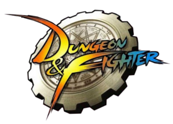

# Dungeon&Fighter Guild Web - ASTERA ⭐️

   
  
   
   

## 프로젝트 소개

던전앤파이터는 리그오브레전드와 함께 오래 전부터 지금까지도 재밌게 즐기고 있는 게임입니다. 두 게임 중 던전앤파이터는 특히 많은 애정을 갖고 플레이하는데, 왜냐하면 이 게임은 <b>아스테라</b>라는 이름으로 길드를 만들어 운영을 시작했기 때문입니다. 게다가 많은 분들께서 관심을 갖고 길드에 오셨고, 이곳에서 함께 성장하여 현재도 큰 문제 없이 운영되고 있기 때문입니다.

사건사고 없이 길드 운영에 많은 도움을 주시고, 게임이 약간 휘청일 때도 잘 버텨주신 길드원분들께 드리는 작은 선물로, 부족한 실력이지만 정적인 길드 웹사이트를 하나 만들어 봤습니다.

   
  
   
   

## 기술 스택

|            HTML            |           CSS            |           Javascript           |             Node             |      AWS EC2 (배포)      |
| :------------------------: | :----------------------: | :----------------------------: | :--------------------------: | :----------------------: |
|  |  |  |  |  |

- Frontend: HTML/CSS/JS (EJS)
- Backend: Node (Express)
- Deploy: Amazon EC2

 

## 배운 점 & 아쉬운 점

웹사이트를 만드는 지식이 전무한 상태에서 진행한 것이기에, 태그 구조나 CSS 작명과 같은 부분에서 억지로 끼워맞춘 부분이 많습니다. 그리고 백엔드의 기능이 웹 서버를 통한 '정적 페이지' 제공 말고는 더 없었기에, Node.js + Express로 백엔드를 구성한 것은 불필요했다 생각합니다. 또한 웹서버 배포를 AWS EC2에 하긴 했으나, 정적인 페이지들만 보여주는 웹사이트였어서 이 역시 큰 낭비였다 생각합니다. 정적인 사이트만 보여주는 거였으면, 속도는 느리지만 그래도 충분히 쓸만한 무료 배포 서비스(GitHub Page 같은)들이 있었을텐데 말이죠.

그래도 이런 경험들이 나중에 프론트엔드와 관련된 프로젝트를 할 때, 많은 도움이 될 거라 생각합니다.

 

## 라이센스

MIT &copy; [NoHack](mailto:lbjp114@gmail.com)
